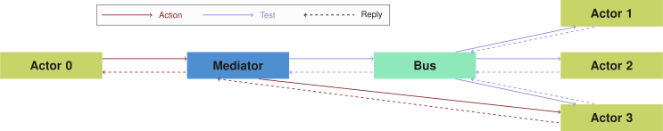

## Architecture
{:#architecture}

In this section, we discuss the design and architecture of the Comunica engine.
In summary, Comunica is collection of small modules that, when wired together,
are able to perform a certain task, such as evaluating SPARQL queries.
We first discuss the main design patterns that are used within Comunica.
After that, we talk about the wiring of modules based on dependency-injection.
Finally, we give an overview of all modules

### Actor-Mediator-Bus Pattern

The modules in comunica work together based on the [_actor_](cite:cites actormodel),
[_mediator_](cite:cites mediatorpattern) and [_publish-subscribe_](cite:cites publishsubscribepattern) patterns.
Any number of _actor_ modules can be created,
where each actor interact with _mediators_, that in its turn invoke other actors that are registered to a certain _bus_.
_Actors_, _buses_ and _mediators_ form the three main categories of modules in Comunica.

Actors are the main computational units in Comunica, and buses and mediators form the _glue_ that ties them together and makes them interactable.
They are responsible for being able to accept certain messages via the bus they are subscribed to and replying with an answer.
Separate buses exist for different message types.
For example, a bus can exist with multiple registered actors for parsing triples in a certain RDF serialization to triple objects,
or another bus can contain actors that join query bindings together in a certain way.

Each actor handles messages in two phases: the _test_ phase and the _run_ phase.
The test phase is used to check if the actor is _able to act_ on a certain type of message,
and if so, what are the conditions under which this action can be performed.
This phase must always come before the run phase, and is used to select which actor is best suited to perform a certain task under certain conditions.
If such an actor is determined, the run phase of a single actor is initiated.
This run phase takes this same type of message, and requires to _effectively act_ on this message,
and return the result of this action.
For example, in the case of RDF parsers, the test phase could be used to check the time and memory requirements of a certain parser.
One parser could be very fast but require a lot of memory,
while another parser could be slower, but require less memory.
Under certain conditions, the optimal parser could be selected based on these parameters.

More complex actors can require the functionality of other types of actors.
For example, a SPARQL query evaluation actor can require the functionality of actors that join streams of bindings.
In order to avoid tight-coupling between such actors, a certain type of _mediator_ is called with a message instead.
Each mediator is linked with a single bus.
When a mediator receives a message, it is responsible for replying this this message by using the actors in some way from the registered bus.
For example, a mediator could exist over the RDF parsers bus and be programmed to always pick the parser that will perform a certain task the fastest.
When this mediator receives a message, it has to send the message to all actors in the bus to invoke their test phases.
Based on their responses, the mediator could determine the actor with the lowest time requirements.
After that, the mediator invokes the run phase of this actor, and returns its response.
More complex mediators could exist that take combine responses of certain responses.

[](#actor-mediator-bus) shows an example logic flow between actors through a mediator and a bus.

<figure id="actor-mediator-bus">

<figcaption markdown="block">
Example logic flow where Actor 0 requires an action to be performed.
This is done by sending the action to the Mediator, which sends a test action to Actors 1, 2 and 3 via the Bus.
The test replies are then collected by the Mediator, and it chooses the best actor for the action, in this case Actor 3.
Finally, the Mediator sends the original action to Actor 3, and returns its response to Actor 0.
</figcaption>
</figure>

### Dynamic Wiring

In order to make actors, mediators and buses loosely coupled and flexible to combine,
we use the concept of [_dependency injection_](cite:cites DependencyInjection)
to wire these modules together at runtime based on a configuration file.
We do this using the [Components.js](cite:cites componentsjs) JavaScript dependency injection framework,
This framework is based on semantic module descriptions and configuration files
using the [Object-Oriented Components ontology](cite:cites describingsoftwareconfigurations).

Using the Components.js framework, we semantically describe all actors, mediators and buses in [JSON-LD](cite:cites jsonld).
[](#config-actor) shows an example of the semantic description of an RDF parser.
The Comunica engine can be _initialized_ using Components.js configuration files,
that describe the wiring between actors, mediators and buses.
For example, [](#config-parser) shows a configuration file of an engine that is able to parse N3 and JSON-LD-based documents.
This example shows that Comunica is, next to its main purpose of being a query engine,
also able to be used for more specific tasks, such as building a custom RDF parser.

<figure id="config-actor" class="listing">
````/code/config-actor.json````
<figcaption markdown="block">
Semantic description of an actor that is able to parse N3-based RDF serializations.
This actor has a single parameter that allows media types to be registered that this parser is able to handle.
In this case, the actor has four default media types that can be overridden via the config file.
</figcaption>
</figure>

<figure id="config-parser" class="listing">
````/code/config-parser.json````
<figcaption markdown="block">
Comunica configuration of `ActorInitRdfParse` for parsing an RDF document in an unknown serialization.
This actor is linked to a mediator with a bus containing two RDF parsers for specific serializations.
</figcaption>
</figure>

### Modules

At the time of writing, comunica consists of 72 different modules.
This consists of 13 buses, 3 mediator types, 51 actors and 5 other modules.
In this section, we will only discuss the most important actors and their interactions.

The main bus in Comunica is the _query operation_ bus, which consists of 15 different actors
that implement the typical SPARQL operations such as quad patterns, basic graph patterns (BGPs), unions, projects, ...
These actors interact with each other using quad and bindings streams,
and act on a query plan in [SPARQL algebra](cite:cites spec:sparqllang).
By default, no query plan rewriting is done, and BGPs are resolved using the original [TPF algorithm](cite:cites ldf).

In order to enable heterogeneous sources to be queried in a federated way,
we allow a list of sources, annotated by type, to be passed when a query is initiated.
These sources are passed down through the chain of query operation actors,
until the quad pattern level is reached.
At this level, different actors exist for handling a single source of a certain type,
such as TPF entrypoints, SPARQL endpoints, local or remote datadumps or [HDT](cite:cites hdt) files.
In the case of multiple sources, one actor exists that implements the federation algorithm of the [TPF client](cite:cites ldf),
but instead of federating over different TPF entrypoints, it federates over different single-source quad pattern actors.

At the end of the pipeline, different actors are available for serializing the results of a query in different ways.
For instance, there are actors for serializing the results according to
the SPARQL [JSON](cite:cites spec:sparqljson) and [XML](cite:cites spec:sparqlxml) result specifications,
but actors with more visual and developer-friendly formats are available as well.