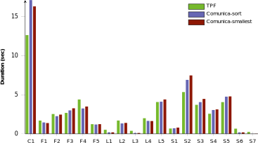

## Comparison with TPF client
{:#comparison-tpf-client}

The primary goal of Comunica is to replace the TPF client as a more *flexible* and *modular* alternative,
with at least the same *functionality* and similar *performance*.
The fact that Comunica supports multiple heterogeneous interfaces and sources as shown in the previous section
validates this flexibility and modularity, as the TPF client only supports querying over TPF entrypoints.
The current implementation of Comunica has all of the functionality of the TPF client, and supersedes it.
Finally, Comunica achieves similar performance compared to the TPF client, as will be shown hereafter.

### Performance

Next to a functional completeness, it is also desired that Comunica achieves similar *performance* compared to the TPF client.
The higher modularity of Comunica is however expected to cause performance overhead,
due to the additional bus and mediator communication, which does not exist in the TPF client.
Hereafter, we compare the performance of the TPF client and Comunica
and discover that Comunica in most cases outperforms the TPF client.
As the main goal of Comunica is modularity, and not performance, we do not compare with similar frameworks such as ARQ and RDFLib.

TODO: discuss setup, exact versions (LSD-way: exact versions in RDF) and configuration

<figure id="performance-average">

<figcaption markdown="block">
Average query evaluation times for the TPF client and Comunica for all queries.
C2 and C3 are shown separately because of their higher evaluation times.
</figcaption>
</figure>

The results from  show that Comunica is able to achieve similar,
and in most cases even better performance than the TPF client.
Concretely, Comunica is faster for 16 queries, and slower for 4 queries.
Overall, Comunica has slightly better performance than the TPF client.
However, the difference in evaluation times is in most cases very small,
and are caused by implementation details, as the implemented algorithms are equivalent.
Contrary to our expectations, the performance overhead of Comunica's modularity is negligible.
Comunica therefore improves upon the TPF client in terms of *modularity*, *functionality* and *performance*.
